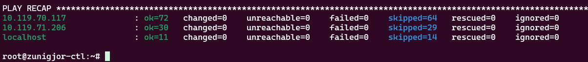

# Nasazení OpenStack

## Vytvoření virtuálních strojů
V http://openstack.ido.in.fit.cvut.cz (běží na školní síti, je potřeba VPN) jsem vytvořil dva virtální stroje. 

Při nastavování instancí byl vybrán Key Pair, který byl vytvořen v openstack.


| Name         | Flavor     | Specs            | IP Address    |
|--------------|------------|------------------|---------------|
| zunigjor-ctl | vcc2.large | 1 VCPU, 12GB RAM | 10.119.70.117 |
| zunigjor-cmp | vcc1.small | 1 VCPU, 4GB RAM  | 10.119.71.206 |


Následně jsem se připojil pomocí příkazu
```
ssh -i ~/.ssh/Home.pem ubuntu@<ip_adresa>
```
Převtělení do root usera jsem provedl pomocí
```
sudo su -
```
A systémy aktualizoval
```
apt update && apt upgrade
```
### SSH přístup velké k malé instanci
**zunigjor-ctl**
```
ssh-keygen
cat .ssh/id_rsa.pub >> .ssh/authorized_keys
```
**zunigjor-cmp**
```
echo <zkopírovaný klíč> >> .ssh/authorized_keys
```

### Vypnutí a smazání firewallu na obou pomocí
```
apt purge firewalld
```

### Vytvoření virtuálního síťového rozhraní
Openstack potřebuje dvě síťová rozhraní. K dispozici je pouze jedno a tak druhé je vytvořeno virtuální.

**zunigjor-ctl** i **zunigjor-cmp**
```
nano /etc/systemd/network/25-veth-b1b2.netdev
```
```
[NetDev]
    Name=veth0
    Kind=veth
[Peer]
    Name=veth1
```
Uložit změny v souboru.
```
nano /etc/netplan/00-installer-config.yaml
```
```
network:
   ethernets:
     ens3:
       dhcp4: true
     veth0: {}
     veth1: {}
   version: 2
```
Uložit změny v souboru.
```
netplan generate
service systemd-networkd stop
service systemd-networkd start
```

## Instalace `kolla-ansible`
Instalace se řídí návodem z cvičení 3 a https://docs.openstack.org/kolla-ansible/zed/user/quickstart.html

### Instalace dependencies:

**zunigjor-ctl** i **zunigjor-cmp**
```
apt install git python3-dev libffi-dev gcc libssl-dev
```

### Instalace pip a Ansible
Všechny další příkazy jsou zadávány na **zunigjor-ctl**
```
apt install python3-pip
pip install -U 'ansible>=4,<6'
```

### Instalace Kolla-ansible (for deployment or evaluation)
Instalace kolla-ansible dependencies pomocí **pip** bez virtuálního prostředí
```
pip3 install git+https://opendev.org/openstack/kolla-ansible@stable/zed
```
Vytvoření složky `/etc/kolla`
```
mkdir -p /etc/kolla
chown $USER:$USER /etc/kolla
```
Zkopírování `globals.yml` and `passwords.yml` do `/etc/kolla`
```
cp -r /usr/local/share/kolla-ansible/etc_examples/kolla/* /etc/kolla
```
Zkopírování `all-in-one` a `multinode` souborů do současné složky
```
cp /usr/local/share/kolla-ansible/ansible/inventory/* .
```

### Instalace Ansible Galaxy požadavků
```
kolla-ansible install-deps
```

### Konfigurace
```
nano multinode
```
Přepíšeme sekce `[control]`, `[network]`, `[compute]`, `[monitoring]` a `[storage]`. Do `[control]` a `[network]` přidáme ip adresu instance VCC_large. Do `[compute]` přidáme ip adresy VCC_large a VCC_small
```
[control]
10.119.70.117

[network]
10.119.70.117

[compute]
10.119.70.117
10.119.71.206

[monitoring]


[storage]

```
```
ansible -i multinode all -m ping
```


### Kolla hesla
```
kolla-genpwd
```

### Kolla globals.yml
```
nano /etc/kolla/globals.yml
```
Tyto řádky byly odkomentovány a změněny na následující hodnoty:
```
kolla_base_distro: "ubuntu"
kolla_internal_vip_address: "10.119.70.117"
network_interface: "ens3"
neutron_external_interface: "veth0"
enable_haproxy: "no"
```

### Deployment
```
kolla-ansible -i ./multinode bootstrap-servers
```
```
kolla-ansible -i ./multinode prechecks
```

```
kolla-ansible -i ./multinode deploy
```


### OpenStack
Instalace CLI klienta pomocí
```
pip install python-openstackclient -c https://releases.openstack.org/constraints/upper/zed
```
```
kolla-ansible post-deploy
```
Spuštění skriptu na vytvoření ukázkových sítí, imagů atd.
```
/usr/local/share/kolla-ansible/init-runonce
```
### Vytvoření instancí
Aktivace proměnných s přihlašovacími udaji
```
source /etc/kolla/admin-openrc.sh
```
Seznam hostů si vypíšu pomocí
```
openstack host list
```


Následně vytvořím jeden image na **zunigjor-ctl** a druhý na **zunigjor-cmp** (--availability-zone) a připojím je do stejné sítě (--network demo-net)
```
openstack server create --image cirros --flavor m1.tiny --availability-zone nova:zunigjor-ctl --key-name mykey --network demo-net demo1
```
```
openstack server create --image cirros --flavor m1.tiny --availability-zone nova:zunigjor-cmp --key-name mykey --network demo-net demo2
```
Seznam VM si vypšu pomocí
```
openstack server list
```


| Name  | Flavor  | Image  | IP Address |
|-------|---------|--------|------------|
| demo1 | m1.tiny | cirros | 10.0.0.241 |
| demo2 | m1.tiny | cirros | 10.0.0.45  |

## GUI
Pro přístup k GUI bylo potřeba ve školním openstacku povolit HTTP
```
> Network > Security groups > Default group > Manage rules > Add rule
> Rule: HTTP
> Add
```
Přihlašovací údaje do GUI se nachází v souboru `/etc/kolla/admin-openrc.sh`
```
cat /etc/kolla/admin-openrc.sh
```
Spuštěné instance jsou viditelné na stránce Instances


Pro přístup ke konzolím je potřeba ve školním openstacku povolit TCP port 6080
```
> Network > Security groups > Default group > Manage rules > Add rule
> Rule: Custom TCP Rule
> Port: 6080
> Add
```

Topologie sítě je vidět na stránce Network Topology


VM demo1 a demo2 jsou nyní schopné se navzájem pingovat.

## Připojení k internetu

Pro připojení VM k internetu je potřeba povolot přesměrování na **zunigjor-ctl**
```
echo 1 > /proc/sys/net/ipv4/ip_forward
```
Přidat IP adresy k síťovému rozhraní
```
ip addr add 10.0.2.1/24 brd 10.0.2.255 dev veth1
```
Nastavit NAT pomocí iptables
```
iptables -t nat -A POSTROUTING -s 10.0.2.0/24 -j MASQUERADE
```

VM jsou nyní schopné pingovat se navzájem a pingovat i `google.com`


