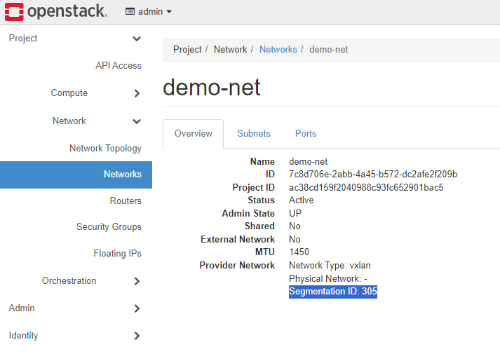

# Popis konfigurace virtualizace a sítě nastavené pomocí OpenStack

## Trasování provozu mezi dvěma VM

Výsledkem předchozího cvičení jsou dva virtuální stroje **demo1** běžící na **zunigjor-ctl** a **demo2** na **zunigjor-cmp**. 

| Name  | Flavor  | Image  | IP Address |
|-------|---------|--------|------------|
| demo1 | m1.tiny | cirros | 10.0.0.241 |
| demo2 | m1.tiny | cirros | 10.0.0.45  |

Na **demo1** jsem spustil ping na **demo2**.


## Nalezení xml deskriptoru virtuálního stroje a v něm jména rozhraní. Trasování provozu mezi 2 VM nebo mezi VM a routerem nebo DHCP serverem na rozhraní příslušející na hypervizoru virtuálnímu stroji

Otevřel jsem si interaktivní terminál v kontejneru nova_libvirt
```
docker exec -it nova_libvirt bash
```
Jméno instance našel pomocí
```
virsh list
```


XML deskriptor virtuálního stroje si vypíšu pomocí
```
virsh dumpxml instance-00000001
```
[Deskriptor rozhraní](./files/virhsh_dumpxml_instance-00000001)
```xml
<interface type='bridge'>
    <mac address='fa:16:3e:ba:2b:6e'/>
    <source bridge='qbrb372bf60-3e'/>
    <target dev='tapb372bf60-3e'/>
    <model type='virtio'/>
    <mtu size='1450'/>
    <alias name='net0'/>
    <address type='pci' domain='0x0000' bus='0x00' slot='0x03' function='0x0'/>
</interface>
```
Z terminálu v kontejneru vystoupím příkazem `exit`

Trasování provozu jsem na **zunigjor-ctl** provedl pomocí příkazu 
```
tcpdump -i tapb372bf60-3e
```


## Trasování provozu tunelovaného pomocí VXLAN mezi dvěma uzly, a to zobrazené v grafickém nástroji Wireshark

Na rozhraní ens3 jede veškerý provoz směřující z Node **zunigjor-ctl**. Komunikace je zabalená ve VXLAN. Log provozu jsem udělal pomocí příkazu
```
tcpdump -i ens3 udp -w tcpdump.log
```

Soubor jsem přesunul do složky `/home/ubuntu` a odtamtud zkopíroval na svůj stroj pomocí

```
scp -i ~/.ssh/Home.pem ubuntu@10.119.70.117:/home/ubuntu/tcpdump.log
```

Následně jsem ho otevřel v programu [Wireshark](https://www.wireshark.org/download.html)


Na obrázku z wiresharku je vidět VXLAN Network Identifier, který je shodný s Segmentation ID uvedeným v Openstack administrátorském rozhraní



## Nakreslit diagram síťových prvků, přes které prochází east-west provoz (mezi dvěma VM na různých hypervizorech), a to s konkrétními jmény rozhraní ve Vaši instalaci OpenStacku 

Diagram east-west provozu vychzází z [diagramu](https://docs.openstack.org/neutron/xena/_images/deploy-ovs-selfservice-compconn1.png) v dokumentaci openstacku a [několika](https://docs.openstack.org/neutron/wallaby/admin/deploy-ovs-selfservice.html#north-south-scenario-1-instance-with-a-fixed-ip-address), [dalších](https://www.rdoproject.org/networking/networking-in-too-much-detail/), [zdrojů](https://github.com/lorin/openstack-hackspace/blob/master/under-the-hood-network.md). 

Pro zjištění názvů jednotlivých prvků na obou nodech, **zunigjor-ctl** a **zunigjor-cmp**, jsem využil příkazu `ip a` v kombinaci s terminálem v kontejneru openvswitch_vswitchd `docker exec -it openvswitch_vswitchd bash` a vypsání informací pomocí `ovs-vsctl show`


## Trasování provozu služby poskytující instancím při startu metadata na adrese 169.254.169.254 od instance přes metadata-proxy až k Nova-API

K vypsání síťových namespaces na **zunigjor-ctl** jsem použil příkaz 
```
ip netns list
```

Výsledkem jsou namespaces:
```
qrouter-686e8d23-80f8-4815-b1d1-13ea93f4ea62 (id: 1)
qdhcp-7c8d706e-2abb-4a45-b572-dc2afe2f209b (id: 0)
```

Nyní nad namespace `qdhcp-7c8d706e-2abb-4a45-b572-dc2afe2f209b` spustím příkaz `ip addr`
```
ip netns exec qdhcp-7c8d706e-2abb-4a45-b572-dc2afe2f209b ip addr
```

```
1: lo: <LOOPBACK,UP,LOWER_UP> mtu 65536 qdisc noqueue state UNKNOWN group default qlen 1000
    link/loopback 00:00:00:00:00:00 brd 00:00:00:00:00:00
    inet 127.0.0.1/8 scope host lo
       valid_lft forever preferred_lft forever
    inet6 ::1/128 scope host
       valid_lft forever preferred_lft forever
16: tap2dd384fe-7b: <BROADCAST,MULTICAST,UP,LOWER_UP> mtu 1450 qdisc noqueue state UNKNOWN group default qlen 1000
    link/ether fa:16:3e:04:89:0f brd ff:ff:ff:ff:ff:ff
    inet 10.0.0.2/24 brd 10.0.0.255 scope global tap2dd384fe-7b
       valid_lft forever preferred_lft forever
    inet 169.254.169.254/32 brd 169.254.169.254 scope global tap2dd384fe-7b
       valid_lft forever preferred_lft forever
    inet6 fe80::a9fe:a9fe/128 scope link
       valid_lft forever preferred_lft forever
    inet6 fe80::f816:3eff:fe04:890f/64 scope link
       valid_lft forever preferred_lft forever
```

Nyní nad namespace `qdhcp-7c8d706e-2abb-4a45-b572-dc2afe2f209b` spustím trasovaní `tcpdump -i tap2dd384fe-7b -vv` pomocí
```
ip netns exec qdhcp-7c8d706e-2abb-4a45-b572-dc2afe2f209b tcpdump -i tap2dd384fe-7b -vv
```
a ve VM **demo1** spustím příkaz `curl 169.254.169.254`. 

Výsledek tcpdump:
```
tcpdump: listening on tap2dd384fe-7b, link-type EN10MB (Ethernet), snapshot length 262144 bytes
17:33:39.392809 IP (tos 0x0, ttl 64, id 9295, offset 0, flags [DF], proto TCP (6), length 60)
    10.0.0.241.44726 > 169.254.169.254.http: Flags [S], cksum 0xf42e (correct), seq 4275220530, win 64860, options [mss 1410,sackOK,TS val 904422341 ecr 0,nop,wscale 6], length 0
17:33:39.392869 IP (tos 0x0, ttl 64, id 0, offset 0, flags [DF], proto TCP (6), length 60)
    169.254.169.254.http > 10.0.0.241.44726: Flags [S.], cksum 0x5f1c (incorrect -> 0x3aac), seq 1183830177, ack 4275220531, win 64308, options [mss 1410,sackOK,TS val 4024218762 ecr 904422341,nop,wscale 7], length 0
17:33:39.393718 IP (tos 0x0, ttl 64, id 9296, offset 0, flags [DF], proto TCP (6), length 52)
    10.0.0.241.44726 > 169.254.169.254.http: Flags [.], cksum 0x5f14 (incorrect -> 0x6084), seq 1, ack 1, win 1014, options [nop,nop,TS val 904422342 ecr 4024218762], length 0
17:33:39.394553 IP (tos 0x0, ttl 64, id 9297, offset 0, flags [DF], proto TCP (6), length 131)
    10.0.0.241.44726 > 169.254.169.254.http: Flags [P.], cksum 0x5f63 (incorrect -> 0x87e2), seq 1:80, ack 1, win 1014, options [nop,nop,TS val 904422343 ecr 4024218762], length 79: HTTP, length: 79
        GET / HTTP/1.1
        Host: 169.254.169.254
        User-Agent: curl/7.84.0
        Accept: */*

17:33:39.434806 IP (tos 0x0, ttl 64, id 52130, offset 0, flags [DF], proto TCP (6), length 52)
    169.254.169.254.http > 10.0.0.241.44726: Flags [.], cksum 0x5f14 (incorrect -> 0x620a), seq 1, ack 80, win 502, options [nop,nop,TS val 4024218804 ecr 904422343], length 0
17:33:39.448127 IP (tos 0x0, ttl 64, id 52131, offset 0, flags [DF], proto TCP (6), length 267)
    169.254.169.254.http > 10.0.0.241.44726: Flags [P.], cksum 0x5feb (incorrect -> 0x2708), seq 1:216, ack 80, win 502, options [nop,nop,TS val 4024218817 ecr 904422343], length 215: HTTP, length: 215
        HTTP/1.1 200 OK
        content-type: text/plain; charset=UTF-8
        content-length: 98
        date: Mon, 22 Apr 2024 17:33:39 GMT

        1.0
        2007-01-19
        2007-03-01
        2007-08-29
        2007-10-10
        2007-12-15
        2008-02-01
        2008-09-01
        2009-04-04
        latest [|http]
17:33:39.451413 IP (tos 0x0, ttl 64, id 9298, offset 0, flags [DF], proto TCP (6), length 52)
    10.0.0.241.44726 > 169.254.169.254.http: Flags [.], cksum 0x5f14 (incorrect -> 0x5ef3), seq 80, ack 216, win 1011, options [nop,nop,TS val 904422397 ecr 4024218817], length 0
17:33:39.463012 IP (tos 0x0, ttl 64, id 9299, offset 0, flags [DF], proto TCP (6), length 52)
    10.0.0.241.44726 > 169.254.169.254.http: Flags [F.], cksum 0x5f14 (incorrect -> 0x5ee4), seq 80, ack 216, win 1011, options [nop,nop,TS val 904422411 ecr 4024218817], length 0
17:33:39.463113 IP (tos 0x0, ttl 64, id 52132, offset 0, flags [DF], proto TCP (6), length 52)
    169.254.169.254.http > 10.0.0.241.44726: Flags [F.], cksum 0x5f14 (incorrect -> 0x60d1), seq 216, ack 81, win 502, options [nop,nop,TS val 4024218832 ecr 904422411], length 0
17:33:39.465066 IP (tos 0x0, ttl 64, id 9300, offset 0, flags [DF], proto TCP (6), length 52)
    10.0.0.241.44726 > 169.254.169.254.http: Flags [.], cksum 0x5f14 (incorrect -> 0x5ed2), seq 81, ack 217, win 1011, options [nop,nop,TS val 904422413 ecr 4024218832], length 0

10 packets captured
10 packets received by filter
0 packets dropped by kernel
```