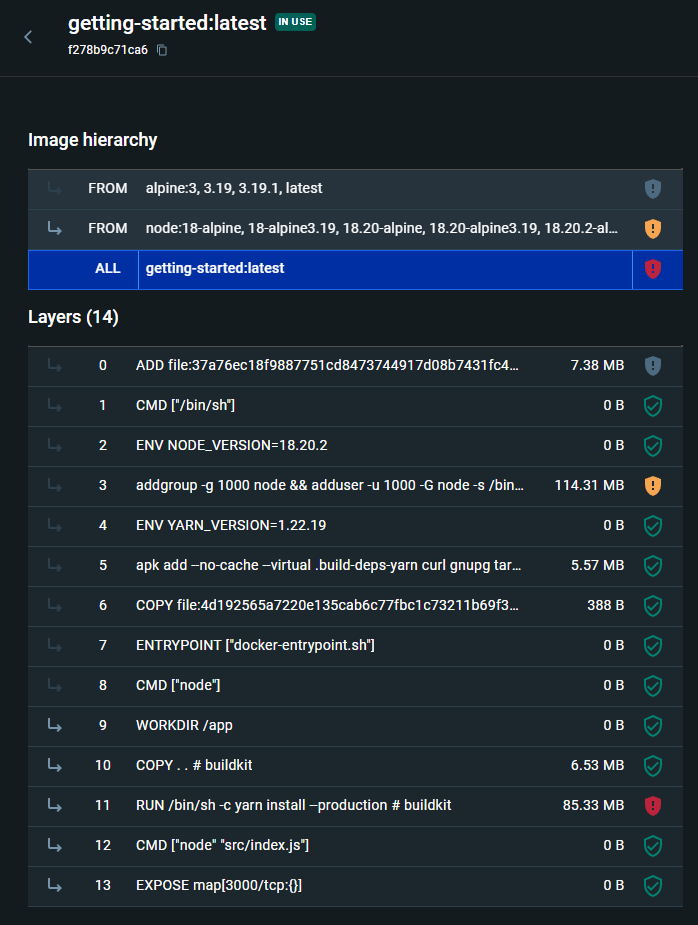
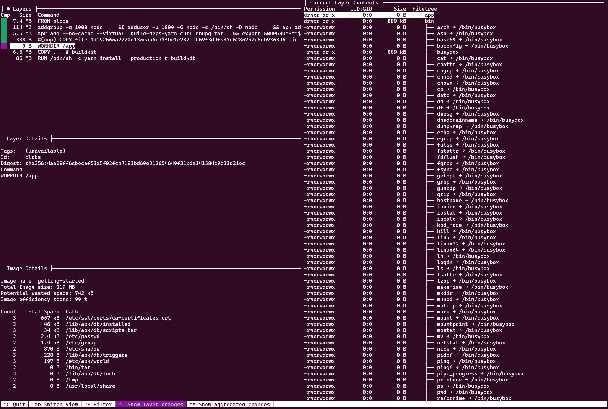

# Nasazení aplikace pomocí Docker

## Sestavení obrazu s nějakou webovou aplikací metodou Dockerfile
Vzužil jsem [getting-started-app](https://github.com/docker/getting-started-app/tree/main) z [dokumentace dockeru](https://docs.docker.com/get-started/02_our_app/).

Zdrojové soubory jsem stáhl pomocí:
```bash
git clone https://github.com/docker/getting-started-app.git
```
Ve staženém projektu jsem vytvořil soubor Dockerfile obsahující:
```dockerfile
# syntax=docker/dockerfile:1

FROM node:18-alpine
WORKDIR /app
COPY . .
RUN yarn install --production
CMD ["node", "src/index.js"]
EXPOSE 3000
```
Vytvořil jsem docker image
```
 docker build -t getting-started .
```
a spustil kontejner
```
docker run -dp 127.0.0.1:3000:3000 getting-started
```
Aplikace je potom dostupná na adrese http://localhost:3000/.

## Analýza obrazu ve formátu OCI/Docker získaného z předchozího kroku pomocí "docker save". 

### Které vrstvy odpovídají podkladovému obrazu a které příkazům z Dockerfile?

```
docker history getting-started
```
```
IMAGE          CREATED          CREATED BY                                      SIZE      COMMENT
f278b9c71ca6   12 minutes ago   EXPOSE map[3000/tcp:{}]                         0B        buildkit.dockerfile.v0
<missing>      12 minutes ago   CMD ["node" "src/index.js"]                     0B        buildkit.dockerfile.v0
<missing>      12 minutes ago   RUN /bin/sh -c yarn install --production # b…   85.3MB    buildkit.dockerfile.v0
<missing>      12 minutes ago   COPY . . # buildkit                             6.53MB    buildkit.dockerfile.v0
<missing>      12 minutes ago   WORKDIR /app                                    0B        buildkit.dockerfile.v0
<missing>      2 weeks ago      /bin/sh -c #(nop)  CMD ["node"]                 0B
<missing>      2 weeks ago      /bin/sh -c #(nop)  ENTRYPOINT ["docker-entry…   0B
<missing>      2 weeks ago      /bin/sh -c #(nop) COPY file:4d192565a7220e13…   388B
<missing>      2 weeks ago      /bin/sh -c apk add --no-cache --virtual .bui…   5.57MB
<missing>      4 weeks ago      /bin/sh -c #(nop)  ENV YARN_VERSION=1.22.19     0B
<missing>      4 weeks ago      /bin/sh -c addgroup -g 1000 node     && addu…   114MB
<missing>      4 weeks ago      /bin/sh -c #(nop)  ENV NODE_VERSION=18.20.2     0B
<missing>      3 months ago     /bin/sh -c #(nop)  CMD ["/bin/sh"]              0B
<missing>      3 months ago     /bin/sh -c #(nop) ADD file:37a76ec18f9887751…   7.38MB
```
Příkazy s komentářem `buildkit.dockerfile.v0` pochází z vytvořeného Dockerfile.

Tyto příkazy se dají najít i v getting-started image hierarchy v aplikaci docker desktop.



Vrstvy a jejich hashe se dají najít i v souboru `manifest.json` vygenerovaném příkazem:

```
docker save -o getting-started.tar getting-started
```

Soubor `getting-started.tar` jsem rozbalil do slozky ./tar. Ve teto slozce je soubor `manifest.json`:

```
[
    {
        "Config": "blobs/sha256/f278b9c71ca69ff2ed6a15fd06150cb7f908d08a7c5dbc26c098ff6ff63494ce",
        "RepoTags": [
            "getting-started:latest"
        ],
        "Layers": [
            "blobs/sha256/d4fc045c9e3a848011de66f34b81f052d4f2c15a17bb196d637e526349601820",
            "blobs/sha256/926b35a05f1d3fc95de053cbd4f0bfe2c62f8678941fa1185b8ff3c12da7af12",
            "blobs/sha256/1da03ac21ec86db4bba318979c90d90acfdce9d48f91ff1bd43a4348c15cd032",
            "blobs/sha256/3fecce3529083b1fb81d54ca7fddd5232b63d5ab301ead39c02eb1cc1d5eb192",
            "blobs/sha256/4aa09ff6cbecaf53a5f02fcb7193bd60e212654649f31bda141584c9e33d21ec",
            "blobs/sha256/9945843b6d2c33fa4ff18adddd3c586ef08634551277d2ed1352f3202b3308f9",
            "blobs/sha256/43b2ccd4d36245ec2b38c2394bcc819f68c9d038f2ff1c675a545fc9f2900657"
        ],
        "LayerSources": {
            "sha256:1da03ac21ec86db4bba318979c90d90acfdce9d48f91ff1bd43a4348c15cd032": {
                "mediaType": "application/vnd.oci.image.layer.v1.tar",
                "size": 5603328,
                "digest": "sha256:1da03ac21ec86db4bba318979c90d90acfdce9d48f91ff1bd43a4348c15cd032"
            },
            "sha256:3fecce3529083b1fb81d54ca7fddd5232b63d5ab301ead39c02eb1cc1d5eb192": {
                "mediaType": "application/vnd.oci.image.layer.v1.tar",
                "size": 3584,
                "digest": "sha256:3fecce3529083b1fb81d54ca7fddd5232b63d5ab301ead39c02eb1cc1d5eb192"
            },
            "sha256:43b2ccd4d36245ec2b38c2394bcc819f68c9d038f2ff1c675a545fc9f2900657": {
                "mediaType": "application/vnd.oci.image.layer.v1.tar",
                "size": 93010944,
                "digest": "sha256:43b2ccd4d36245ec2b38c2394bcc819f68c9d038f2ff1c675a545fc9f2900657"
            },
            "sha256:4aa09ff6cbecaf53a5f02fcb7193bd60e212654649f31bda141584c9e33d21ec": {
                "mediaType": "application/vnd.oci.image.layer.v1.tar",
                "size": 1536,
                "digest": "sha256:4aa09ff6cbecaf53a5f02fcb7193bd60e212654649f31bda141584c9e33d21ec"
            },
            "sha256:926b35a05f1d3fc95de053cbd4f0bfe2c62f8678941fa1185b8ff3c12da7af12": {
                "mediaType": "application/vnd.oci.image.layer.v1.tar",
                "size": 116508160,
                "digest": "sha256:926b35a05f1d3fc95de053cbd4f0bfe2c62f8678941fa1185b8ff3c12da7af12"
            },
            "sha256:9945843b6d2c33fa4ff18adddd3c586ef08634551277d2ed1352f3202b3308f9": {
                "mediaType": "application/vnd.oci.image.layer.v1.tar",
                "size": 6593024,
                "digest": "sha256:9945843b6d2c33fa4ff18adddd3c586ef08634551277d2ed1352f3202b3308f9"
            },
            "sha256:d4fc045c9e3a848011de66f34b81f052d4f2c15a17bb196d637e526349601820": {
                "mediaType": "application/vnd.oci.image.layer.v1.tar",
                "size": 7667200,
                "digest": "sha256:d4fc045c9e3a848011de66f34b81f052d4f2c15a17bb196d637e526349601820"
            }
        }
    }
]
```
Na jednotlivé vrstvy se mohu podívat i nástrojem [`dive`](https://github.com/wagoodman/dive).



Kde vidím které vrstvy jsou z podkladového image `node:18-alpine` a které jsou vytvořeny v rámci Dockerfile.

- Vrstva `4aa09f` odpovídá příkazu `WORKDIR /app`
- Vrstva `994584` odpovídá příkazu `COPY . .`
- Vrstva `43b2cc` odpovídá příkazu `RUN /bin/sh -c yarn install --production`

## Vytvoření systémového kontejneru s jinou distribucí než Debian a Ubuntu.

Postupoval jsem podle návodu https://wiki.archlinux.org/title/Systemd-nspawn pro instalaci Alma Linuxu. Kroky jsem provedl na **zunigjor-ctl**.

Nainstaloval jsem package manager DNF (Dandified Yum)
```
sudo apt install dnf
```

A do `/etc/dnf/dnf.conf` přidal

```
[baseos]
name=AlmaLinux $releasever - BaseOS
mirrorlist=https://mirrors.almalinux.org/mirrorlist/$releasever/baseos
gpgkey=https://repo.almalinux.org/almalinux/RPM-GPG-KEY-AlmaLinux-$releasever
```

Kontejner jsem nainstaloval 
```
dnf --repo=baseos --releasever=9 --best --installroot=/var/lib/machines/vcc-almaLinux --setopt=install_weak_deps=False install almalinux-release dhcp-client dnf glibc-langpack-en iproute iputils less passwd systemd vim-minimal nano
```
Otestoval 
```
root@zunigjor-ctl:~# systemd-nspawn -D /var/lib/machines/vcc-almaLinux/
Spawning container vcc-almaLinux on /var/lib/machines/vcc-almaLinux.
Press ^] three times within 1s to kill container.
[root@vcc-almaLinux ~]# ls
[root@vcc-almaLinux ~]# touch test
[root@vcc-almaLinux ~]# ls
test
```
```
machinectl start vcc-almaLinux
machinectl status vcc-almaLinux
```
```
root@zunigjor-ctl:~# machinectl status vcc-almaLinux
vcc-almaLinux(be681dd13db54d4fae6ce1742bd78262)
           Since: Sat 2024-05-11 20:15:20 UTC; 2min 21s ago
          Leader: 162319 (systemd)
         Service: systemd-nspawn; class container
            Root: /var/lib/machines/vcc-almaLinux
           Iface: ve-vcc-almaX9aN
              OS: AlmaLinux 9.4 (Seafoam Ocelot)
       UID Shift: 647430144
            Unit: systemd-nspawn@vcc-almaLinux.service
                  ├─payload
                  │ ├─init.scope
                  │ │ └─162319 /usr/lib/systemd/systemd
                  │ └─system.slice
                  │   ├─console-getty.service
                  │   │ └─162347 /sbin/agetty -o "-p -- \\u" --noclear --keep-baud - 115200,38400,9600 vt220
                  │   ├─dbus-broker.service
                  │   │ ├─162355 /usr/bin/dbus-broker-launch --scope system --audit
                  │   │ └─162357 dbus-broker --log 4 --controller 9 --machine-id be681dd13db54d4fae6ce1742bd78262 --max-bytes 536870912 --max-fds 4096 --max-matches 16384 --audit
                  │   ├─systemd-journald.service
                  │   │ └─162334 /usr/lib/systemd/systemd-journald
                  │   └─systemd-logind.service
                  │     └─162345 /usr/lib/systemd/systemd-logind
                  └─supervisor
                    └─162316 systemd-nspawn --quiet --keep-unit --boot --link-journal=try-guest --network-veth -U --settings=override --machine=vcc-almaLinux

May 11 20:15:23 zunigjor-ctl systemd-nspawn[162316]: [  OK  ] Started User Login Management.
May 11 20:15:23 zunigjor-ctl systemd-nspawn[162316]: [  OK  ] Reached target Multi-User System.
May 11 20:15:23 zunigjor-ctl systemd-nspawn[162316]: [  OK  ] Reached target Graphical Interface.
May 11 20:15:23 zunigjor-ctl systemd-nspawn[162316]:          Starting Record Runlevel Change in UTMP...
May 11 20:15:23 zunigjor-ctl systemd-nspawn[162316]: [  OK  ] Finished Record Runlevel Change in UTMP.
May 11 20:15:23 zunigjor-ctl systemd-nspawn[162316]: [  OK  ] Started D-Bus System Message Bus.
May 11 20:15:24 zunigjor-ctl systemd-nspawn[162316]:
May 11 20:15:24 zunigjor-ctl systemd-nspawn[162316]: AlmaLinux 9.4 (Seafoam Ocelot)
May 11 20:15:24 zunigjor-ctl systemd-nspawn[162316]: Kernel 5.15.0-1057-kvm on an x86_64
May 11 20:15:24 zunigjor-ctl systemd-nspawn[162316]:
```
Vypsání běžících kontejnerů
```
root@zunigjor-ctl:~# machinectl
MACHINE       CLASS     SERVICE        OS        VERSION ADDRESSES
vcc-almaLinux container systemd-nspawn almalinux 9.4     -

1 machines listed.
```
## Napsání jednotkového souboru pro Systemd (unit file), který v "systemd-analyze security" bude mít alespoň žluté skóre zabezpečení.
Dle návrhu z courses jsem využil tinyproxy

```
apt install tinyproxy
```

Upravil jsem konfigurační soubor na jeho minimalní podobu podle [dokumentace](https://tinyproxy.github.io/).

```
Port 8888
Listen 127.0.0.1
Timeout 600
Allow 127.0.0.1
```

V `/etc/systemd/system` jsem vytvořil `tinyproxy.service`

```
[Unit]
Description=Tinyproxy
After=network.target

[Service]
ExecStart=/usr/bin/tinyproxy -d

[Install]
WantedBy=default.target
```

A service tinyproxy spustil 

```
systemctl daemon-reload
systemctl start tinyproxy.service
systemctl status tinyproxy.service
```
```
root@zunigjor-ctl:/# systemctl status tinyproxy.service
● tinyproxy.service - Tinyproxy
     Loaded: loaded (/etc/systemd/system/tinyproxy.service; enabled; vendor preset: enabled)
     Active: active (running) since Sat 2024-05-11 20:23:04 UTC; 12min ago
   Main PID: 173455 (tinyproxy)
      Tasks: 1 (limit: 14378)
     Memory: 1.1M
        CPU: 33ms
     CGroup: /system.slice/tinyproxy.service
             └─173455 /usr/bin/tinyproxy

May 11 20:23:04 zunigjor-ctl tinyproxy[173455]: listening on fd [0]
May 11 20:23:04 zunigjor-ctl tinyproxy[173455]: trying to listen on host[::], family[10], socktype[1], proto[6]
May 11 20:23:04 zunigjor-ctl tinyproxy[173455]: listening on fd [1]
May 11 20:23:04 zunigjor-ctl tinyproxy[173455]: Now running as group "tinyproxy".
May 11 20:23:04 zunigjor-ctl tinyproxy[173455]: Now running as user "tinyproxy".
May 11 20:23:04 zunigjor-ctl tinyproxy[173455]: ERROR: Could not create log file /var/log/tinyproxy/tinyproxy.log: Bad file descriptor.
May 11 20:23:04 zunigjor-ctl tinyproxy[173455]: Falling back to syslog logging.
May 11 20:23:04 zunigjor-ctl tinyproxy[173455]: Setting the various signals.
May 11 20:23:04 zunigjor-ctl tinyproxy[173455]: Starting main loop. Accepting connections.
May 11 20:23:04 zunigjor-ctl systemd[1]: Started Tinyproxy lightweight HTTP Proxy.
```

Otestoval 

```
root@zunigjor-ctl:/# curl -x http://127.0.0.1:8888 https://google.com
<HTML><HEAD><meta http-equiv="content-type" content="text/html;charset=utf-8">
<TITLE>301 Moved</TITLE></HEAD><BODY>
<H1>301 Moved</H1>
The document has moved
<A HREF="https://www.google.com/">here</A>.
</BODY></HTML>
```

Skore zabezpečení získal pomocí

```
root@zunigjor-ctl:/# systemd-analyze security | grep tinyproxy
tinyproxy.service                          9.6 UNSAFE    😨
```

Po několika pokusech jsem se dostal na
```
root@zunigjor-ctl:/etc/systemd/system# systemd-analyze security | grep tinyproxy
tinyproxy.service                          6.1 MEDIUM    😐
```

Pomocí:

```
[Unit]
Description=Tinyproxy
After=network.target

[Service]
Type=simple
ExecStart=/usr/bin/tinyproxy -d
User=tinyproxy
Group=tinyproxy
PrivateTmp=true
PrivateUsers=true
ProtectClock=true
ProtectControlGroups=true
ProtectHome=true
ProtectKernelLogs=true
ProtectKernelModules=true
ProtectKernelTunables=true
NoNewPrivileges=true
RestrictNamespaces=uts ipc pid user cgroup
ProtectSystem=strict

PrivateDevices=true
ExecReload=/bin/kill -HUP $MAINPID
Restart=always


[Install]
WantedBy=default.target
```
